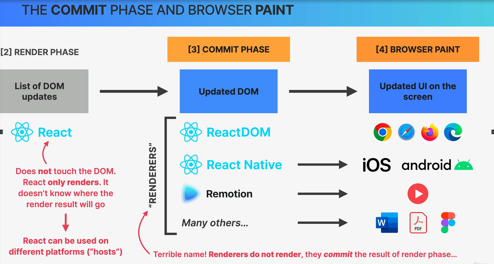

# Commit Phase

In the context of rendering in React or other modern web development frameworks, the "commit phase" is a crucial step that follows the "reconciliation phase." It is the phase in which the changes determined during reconciliation are applied to the actual Document Object Model (DOM), resulting in the visual update of the user interface.

Here's a breakdown of the commit phase:

1. **Reconciliation Phase**: Before the commit phase, React (or another framework) performs the reconciliation phase, where it determines what changes need to be made to the Virtual DOM in order to bring it in sync with the updated state of the application. This phase involves computing the minimal set of updates required to reflect the new UI state.

2. **Commit Phase**: Once the reconciliation phase is completed, the commit phase begins. During this phase, React applies the computed changes to the actual DOM. This may include adding, updating, or removing DOM elements or attributes based on the differences between the Virtual DOM and the real DOM.

   - **Mounting**: When new components or elements are introduced (e.g., when rendering a new component for the first time), they are created in the real DOM during the commit phase. This is referred to as "mounting."

   - **Updating**: Existing elements in the real DOM that have changed are updated to reflect the new data and attributes. This is where React efficiently updates only what has changed, rather than re-rendering the entire DOM.

   - **Unmounting**: Elements that are no longer needed or were removed from the Virtual DOM during reconciliation are removed from the real DOM. This process is known as "unmounting."

3. **Side Effects**: The commit phase is also where certain side effects are applied, such as running lifecycle methods or handling event listeners for components. These side effects are executed after the changes to the DOM have been applied.

The commit phase is crucial for rendering because it ensures that the user interface accurately reflects the current state of the application. By updating the DOM efficiently and synchronously with the changes identified during reconciliation, it helps maintain a responsive and visually consistent user experience.

The combination of the reconciliation and commit phases, along with techniques like the Virtual DOM and the Fiber architecture in React, plays a vital role in optimizing the rendering process and improving the performance of web applications.