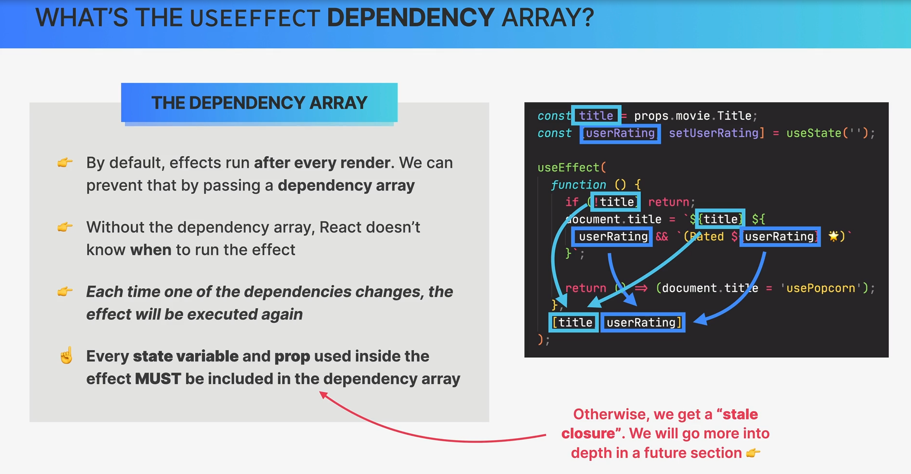

# Dependency Array in useEffect

In React, the `useEffect` hook is used to perform side effects in your functional components. It allows you to perform tasks like data fetching, manual DOM manipulations, or setting up and cleaning up event listeners. The `useEffect` hook can take two arguments: a function and a dependency array. The dependency array is an optional second argument that specifies when the effect should be re-run.



Here's the basic syntax of `useEffect` with a dependency array:

```javascript
useEffect(() => {
  // Your side effect code goes here
}, [dependencies]);
```

The `dependencies` array is an array of variables or values that the effect depends on. If any of these dependencies change between renders, the effect function will be re-executed. If the dependency array is empty (`[]`), the effect will only run once after the initial render.

The purpose of specifying dependencies is to ensure that your effect runs only when necessary. This can help optimize the performance of your component and avoid unnecessary re-renders.

Here are a few examples to illustrate how the dependency array works:

1. Effect with No Dependencies (Runs once after initial render):

```javascript
useEffect(() => {
  // This effect runs once after the initial render
}, []);
```

2. Effect with Specific Dependencies (Runs whenever the dependencies change):

```javascript
const userId = ...; // Some value
useEffect(() => {
  // This effect runs when userId changes
}, [userId]);
```

3. Effect with Multiple Dependencies (Runs when any of the dependencies change):

```javascript
const count = ...; // Some value
const username = ...; // Some value
useEffect(() => {
  // This effect runs when either count or username changes
}, [count, username]);
```

4. Effect without Dependency Array (Runs after every render):

```javascript
useEffect(() => {
  // This effect runs after every render
});
```

Be cautious when using the dependency array to avoid infinite loops. Make sure that the values you include in the array change only when you intend the effect to run again. If you omit the dependency array entirely, the effect will run after every render, which may lead to performance issues if not managed correctly.
