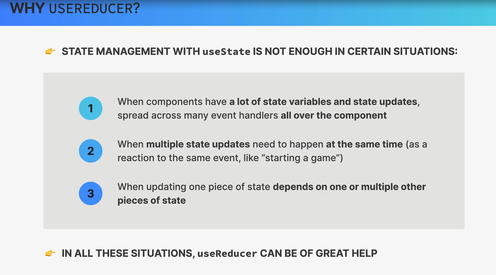
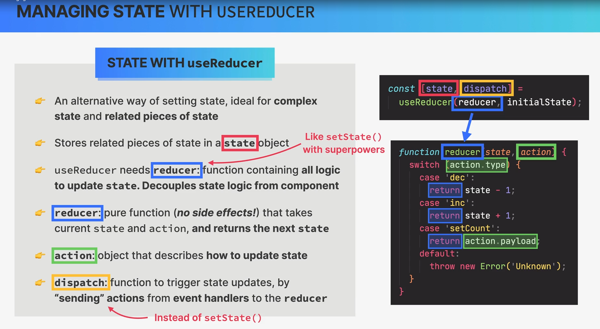
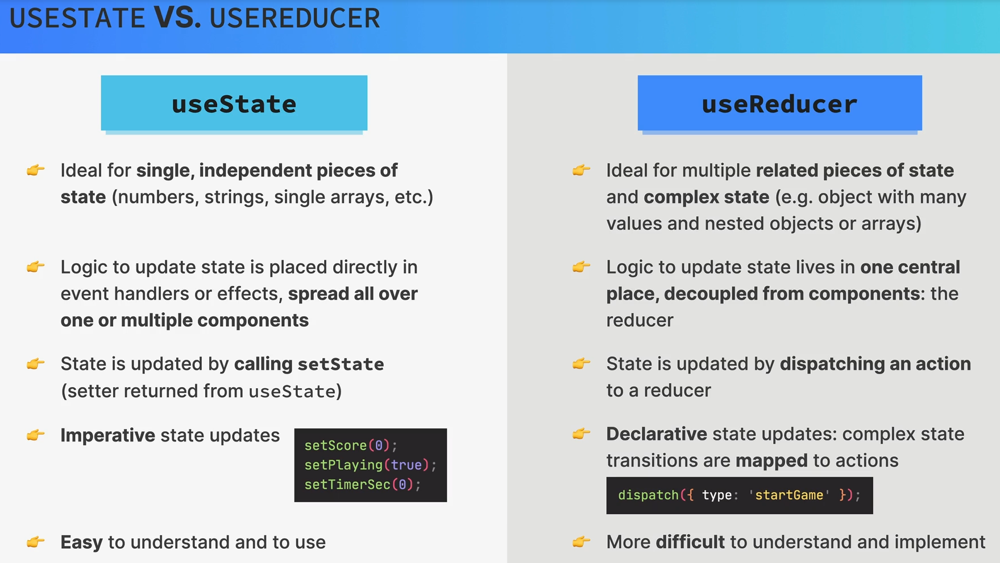
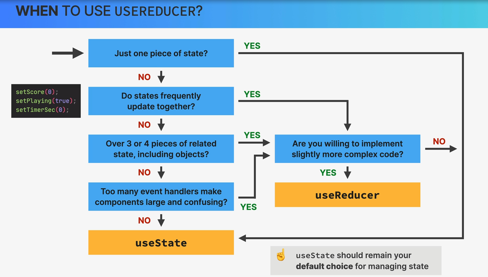

The `useReducer` hook is a built-in hook in React that allows you to manage complex state logic in a more organized and predictable way, especially when dealing with state that has multiple actions or transitions. It is an alternative to the `useState` hook and is often used when you have more complex state management needs.

Here's how you can use the `useReducer` hook in a React component:

```jsx
import React, { useReducer } from "react";

// Define your reducer function. It takes the current state and an action as arguments and returns the new state.
const reducer = (state, action) => {
  switch (action.type) {
    case "INCREMENT":
      return { count: state.count + 1 };
    case "DECREMENT":
      return { count: state.count - 1 };
    default:
      return state;
  }
};

function Counter() {
  // Initialize the state and provide the reducer function and an initial state.
  const [state, dispatch] = useReducer(reducer, { count: 0 });

  // Define functions that dispatch actions to update the state.
  const increment = () => {
    dispatch({ type: "INCREMENT" });
  };

  const decrement = () => {
    dispatch({ type: "DECREMENT" });
  };

  return (
    <div>
      <p>Count: {state.count}</p>
      <button onClick={increment}>Increment</button>
      <button onClick={decrement}>Decrement</button>
    </div>
  );
}

export default Counter;
```

In this example, we define a reducer function that takes the current state and an action as arguments and returns the new state. The `useReducer` hook is then used to initialize the state with an initial value and the reducer function. We also define functions (`increment` and `decrement`) that dispatch actions to update the state. When these functions are called, they specify the type of action they represent, and the reducer function handles the state updates accordingly.

Using `useReducer` can make your code more maintainable and scalable when dealing with complex state management, as it centralizes state logic and makes it easier to understand and modify.

# Why useReducer ?



# Managing state with useReduce



# useState vs useReducer



# When to use useReducer ?


