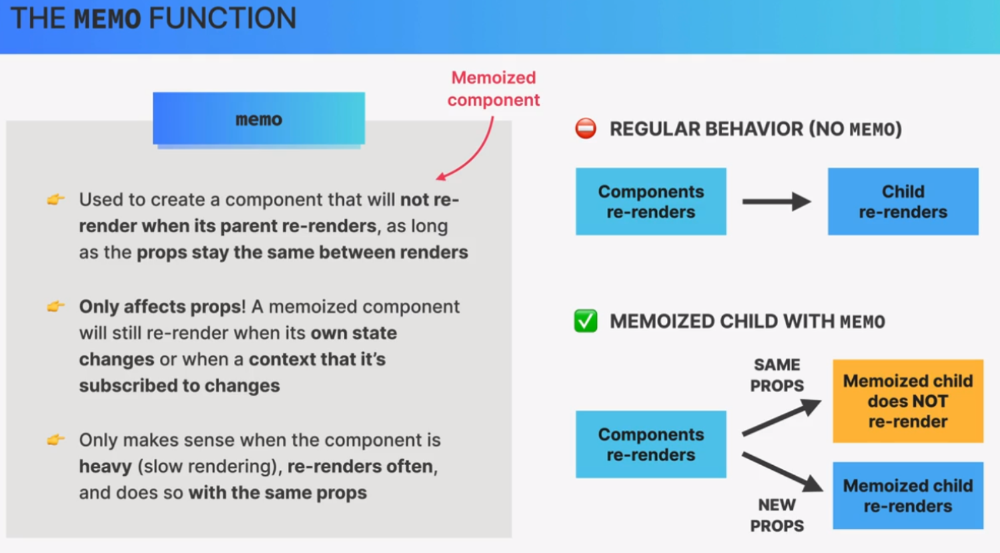

It appears there might be a small confusion in terminology. The term "Memo function" might be a bit ambiguous. However, I'll provide explanations for two possibilities based on common interpretations:

1. **Memoization Function:**

   - A memoization function is a function that implements memoization, a technique used to optimize the performance of functions by caching their results. The idea is to store the results of expensive function calls and return the cached result when the same inputs occur again. This can be particularly useful in scenarios where the same computation is repeated with the same inputs, reducing redundant calculations and improving efficiency.

2. **React.memo Function:**

   - In the context of React, there is a function called `React.memo` that is used to memoize functional components. `React.memo` is a higher-order component (HOC) that wraps a functional component and prevents it from re-rendering if its props have not changed. This is particularly useful for optimizing React components and avoiding unnecessary renders.
   - Memoization is a technique used in programming to optimize the execution of expensive functions by storing their results and reusing them when the same inputs
     

   ```jsx
   import React from "react";

   const MyComponent = React.memo(({ data }) => {
     console.log("Rendering MyComponent");
     return <div>{data}</div>;
   });
   ```

   In this example, `MyComponent` will only re-render if the `data` prop changes. The rendering is memoized, improving the component's performance.

If you have a specific context or use case in mind, please provide more details, and I'll be happy to provide a more targeted explanation.
